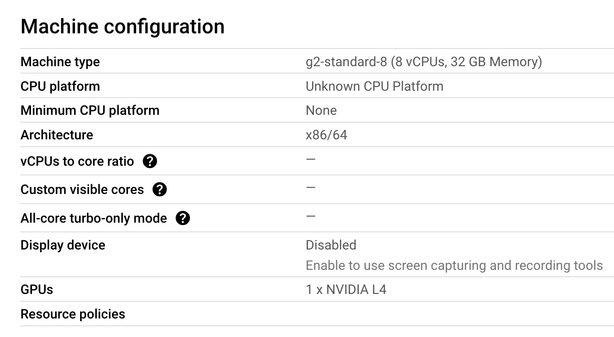

# Color Calibration Card Detection Project

## Project Overview and Objectives
This project aims to develop an automated system for detecting and standardizing color calibration cards in images. The system is designed to accurately locate color calibration cards and apply image processing techniques to achieve standardized presentation, laying the foundation for subsequent color calibration work.

The objective of this project is to use a calibration card to detect color, in any kind of circumstances. The detecting model can detect all kind of colors, which means it has the capability of generalization.


## Project Framework


## Phase 1: ETL Processing

### Find Patterns


**Step1. Annotation**

Implement YOLOv8 for color calibration card detection.

Firstly recognize the card:


Secondly recognize the patterns:


**Step2. Training YOLOv8 model**
Create a GCP VM to train the model:





**Step3. Use YOLOv8 to detect patterns**


## Phase 2: ETV Processing

1. **Feature Extraction**
   - Extract Red, Green, Blue, and Contrast values (`Rp, Gp, Bp, Cp`).
   - Label each detected pattern with its corresponding reference color.
   - Store extracted features in structured datasets for further processing.

2. **Data Preprocessing**
   - Normalize color values to ensure consistency across different lighting conditions.
   - Apply noise reduction techniques to improve data quality.
   - Implement automatic outlier detection and correction mechanisms.

3. **Data Storage and Versioning**
   - Store processed data in a version-controlled database using **DVC**.
   - Maintain different versions for traceability and reproducibility.

## Phase 3: MTL Processing

In phase 3, the system will focus on **Machine Learning Training & Learning**:

1. **Model Training & Validation**
   - Train machine learning models on the extracted feature dataset.
   - Evaluate different models (e.g., SVM, Random Forest, Neural Networks) for best accuracy.
   - Apply hyperparameter tuning to optimize model performance.

2. **MLflow Experiment Tracking**
   - Log model training runs, parameters, and metrics using **MLflow**.
   - Enable easy model comparison and reproducibility.
   - Store best-performing models in the **Model Registry**.

3. **Inference Artifact Generation**
   - Convert trained models into deployable inference artifacts.
   - Optimize models for real-time inference efficiency.
   - Prepare models for integration into production.

## Phase 4: MRD Processing

In phase 4, the system will be **deployed and monitored**:

1. **Model Deployment**
   - Deploy the trained model as a **FastAPI REST API** for real-time inference.
   - Containerize the deployment using **Docker & Kubernetes**.
   - Implement auto-scaling for handling different workloads.

2. **Model Registry & Version Control**
   - Store all trained models in the **Model Registry** with versioning.
   - Enable easy rollback in case of performance degradation.
   - Maintain metadata logs for auditability and traceability.

3. **Monitoring & Continuous Improvement**
   - Implement monitoring tools (**Prometheus, Grafana**) to track model performance.
   - Detect concept drift and trigger re-training when necessary.
   - Set up an alerting system for anomaly detection and failures.


## Project Structrue Plan
```
color_calibration/
├── .github/                        # CI/CD workflows
│   └── workflows/
│       ├── ci.yml                 # Continuous Integration
│       ├── cd.yml                 # Continuous Deployment
│       └── model-training.yml     # Model training pipeline
│
├── configs/                        # Configurations
│   ├── model/                     # Model configs
│   │   ├── model_params.yaml
│   │   └── training_params.yaml
│   ├── monitoring/                # Monitoring configs
│   │   ├── prometheus.yml
│   │   └── grafana-dashboards/
│   └── deployment/                # Deployment configs
│       ├── dev/
│       ├── staging/
│       └── prod/
│
├── data/                          # Data management (DVC tracked)
│   ├── raw/
│   ├── processed/
│   ├── train/
│   └── val/
│
├── deployment/                    # Deployment configurations
│   ├── docker/
│   │   ├── Dockerfile.api
│   │   ├── Dockerfile.training
│   │   └── docker-compose.yml
│   ├── kubernetes/
│   │   ├── api-deployment.yaml
│   │   ├── training-job.yaml
│   │   └── monitoring/
│   └── terraform/                # Infrastructure as Code
│       ├── main.tf
│       └── variables.tf
│
├── mlops/                        # MLOps specific code
│   ├── monitoring/
│   │   ├── metrics.py
│   │   └── alerts.py
│   ├── pipelines/
│   │   ├── training_pipeline.py
│   │   └── deployment_pipeline.py
│   └── serving/
│       ├── api.py
│       └── middleware.py
│
├── notebooks/                    # Development notebooks
│   ├── exploration/
│   ├── experimentation/
│   └── analysis/
│
├── src/                         # Core application code
│   ├── detection/
│   ├── corner/
│   ├── transform/
│   └── utils/
│
├── tests/                       # Test suite
│   ├── unit/
│   ├── integration/
│   └── e2e/
│
├── tools/                       # Development tools
│   ├── quality_checks/
│   └── model_analysis/
│
├── .dvc/                        # DVC configuration
├── .env.example                 # Environment variables template
├── Makefile                     # Build automation
├── requirements/
│   ├── requirements.txt         # Base requirements
│   ├── requirements-dev.txt     # Development requirements
│   └── requirements-prod.txt    # Production requirements
│
└── scripts/
    ├── setup_monitoring.sh
    ├── deploy_model.sh
    └── run_tests.sh
```
