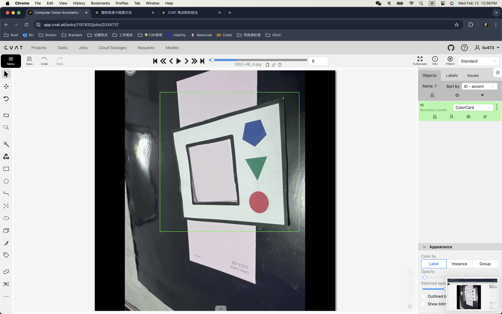
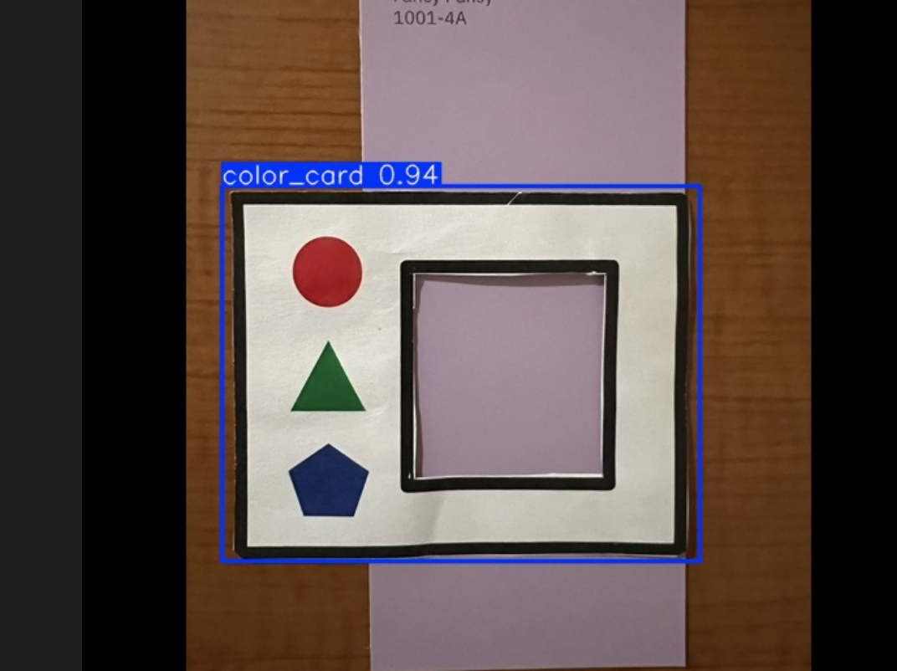
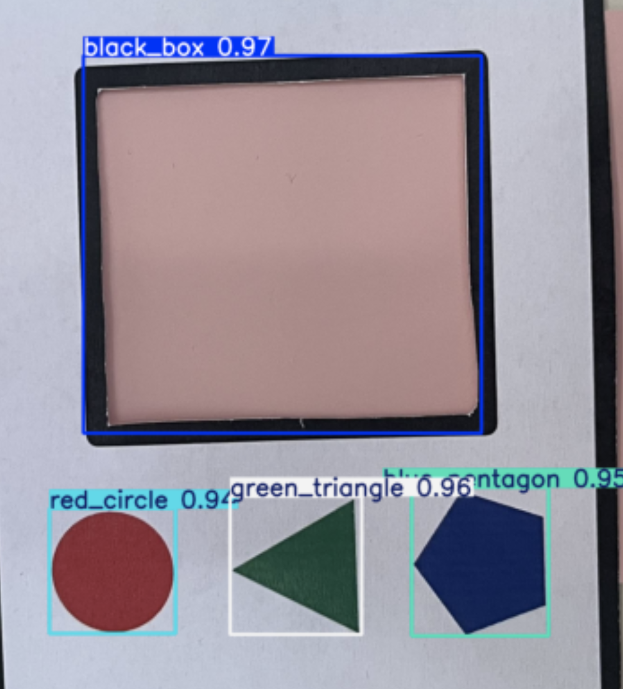
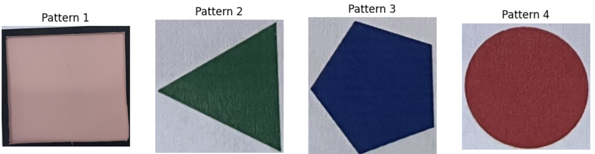

# Color Calibration Card Detection Project

## Project Overview
This project aims to develop an automated system for detecting and standardizing color calibration cards in images. The system is designed to accurately locate color calibration cards and apply image processing techniques to achieve standardized presentation, laying the foundation for subsequent color calibration work.

## Project Objectives
The project is divided into three main phases, each with specific goals and technical approaches.

**Implementation Roadmap:**
1. [x] Dataset collection (Finished by classmates)
2. [x] Annotation via cvat.ai
3. [x] YOLO model training
4. [x] Card detection 
5. [ ] Perspective transform 
6. [ ] Phase 1 integration testing
7. [ ] Phase 2 planning and implementation
8. [ ] Phase 3 planning and implementation

### Phase 1: Calibration Card Detection and Standardization
1. **Object Detection**
   - Implement YOLO for color calibration card detection
   - Train on custom dataset to improve detection accuracy
   - Output bounding box coordinates for calibration cards




1. **Card Detection**
   - Process within YOLO-detected bounding boxes
   - <s>Apply corner detection algorithms to locate four corners of the calibration card</s>
   - Corner detection doesn't work since some corners might be covered by hand.
   - Recognize the card exactly. 






---

2. **Perspective Correction**
   - Implement perspective transform techniques
   - Use detected corner points for image rectification
   - Generate standardized view of calibration cards

### Phase 2: Color Recognition and Calibration
This phase will commence after the successful completion of Phase 1, including:
- Illumination effect elimination
- Environmental noise reduction
- Color difference calculation and analysis
- Color accuracy assessment

### Phase 3: MLOps and Product Implementation

After successfully implementing the core functionality in a research environment, this project is planned to evolve into a production-grade MLOps system, including CI/CD pipelines, model management, cloud computing, and monitoring framework.

## Project Plan
```
color_calibration/
├── .github/                        # CI/CD workflows
│   └── workflows/
│       ├── ci.yml                 # Continuous Integration
│       ├── cd.yml                 # Continuous Deployment
│       └── model-training.yml     # Model training pipeline
│
├── configs/                        # Configurations
│   ├── model/                     # Model configs
│   │   ├── model_params.yaml
│   │   └── training_params.yaml
│   ├── monitoring/                # Monitoring configs
│   │   ├── prometheus.yml
│   │   └── grafana-dashboards/
│   └── deployment/                # Deployment configs
│       ├── dev/
│       ├── staging/
│       └── prod/
│
├── data/                          # Data management (DVC tracked)
│   ├── raw/
│   ├── processed/
│   ├── train/
│   └── val/
│
├── deployment/                    # Deployment configurations
│   ├── docker/
│   │   ├── Dockerfile.api
│   │   ├── Dockerfile.training
│   │   └── docker-compose.yml
│   ├── kubernetes/
│   │   ├── api-deployment.yaml
│   │   ├── training-job.yaml
│   │   └── monitoring/
│   └── terraform/                # Infrastructure as Code
│       ├── main.tf
│       └── variables.tf
│
├── mlops/                        # MLOps specific code
│   ├── monitoring/
│   │   ├── metrics.py
│   │   └── alerts.py
│   ├── pipelines/
│   │   ├── training_pipeline.py
│   │   └── deployment_pipeline.py
│   └── serving/
│       ├── api.py
│       └── middleware.py
│
├── notebooks/                    # Development notebooks
│   ├── exploration/
│   ├── experimentation/
│   └── analysis/
│
├── src/                         # Core application code
│   ├── detection/
│   ├── corner/
│   ├── transform/
│   └── utils/
│
├── tests/                       # Test suite
│   ├── unit/
│   ├── integration/
│   └── e2e/
│
├── tools/                       # Development tools
│   ├── quality_checks/
│   └── model_analysis/
│
├── .dvc/                        # DVC configuration
├── .env.example                 # Environment variables template
├── Makefile                     # Build automation
├── requirements/
│   ├── requirements.txt         # Base requirements
│   ├── requirements-dev.txt     # Development requirements
│   └── requirements-prod.txt    # Production requirements
│
└── scripts/
    ├── setup_monitoring.sh
    ├── deploy_model.sh
    └── run_tests.sh
```

## Develop Log