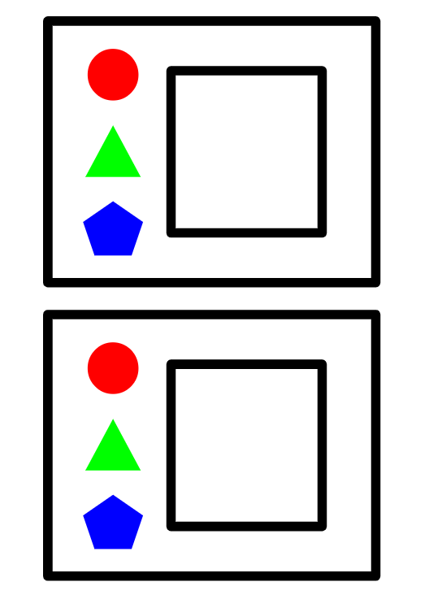

<div align="center">

[](README.md)
[](README_zh.md)

<h1>Card Calibration</h1>

<p>
  
  
  
  
  
  
</p>

<p>
  <strong>Automated color calibration: detect a calibration card in any photo, extract reference patches, and predict the true color of a target under standard lighting.</strong>
</p>

<p>
  <a href="https://huggingface.co/spaces/jeffliulab/card-calibration-v1"></a>
  <a href="https://huggingface.co/jeffliulab/card-calibration-v1"></a>
  <a href="https://huggingface.co/datasets/jeffliulab/card-calibration-v1-data"></a>
</p>

</div>

---

## Highlights

- **Lab Mean ΔE = 4.59** — meets general commercial printing standards (XGBoost with Bayesian-optimized hyperparameters)
- **Two-stage YOLO detection** — card localization + four-patch pattern recognition, fully automated
- **12-feature engineering** — 9 reference deltas + 3 target RGB channels, feeding tree-based regressors
- **One-click HuggingFace demo** — upload a photo, get predicted true color in seconds
- **Printable calibration card** — download and print the included card template for your own tests

---

## Table of Contents

- [Live Demo](#live-demo)
- [Project Topology](#project-topology)
- [Task Definition](#task-definition)
- [Architecture](#architecture)
- [Results](#results)
- [Project Structure](#project-structure)
- [Quick Start](#quick-start)
- [Data](#data)
- [Links](#links)
- [Acknowledgments](#acknowledgments)

---

## Project Topology

```
                    GitHub
              jeffliulab/Color_Calibration
              (source code, scripts, docs)
                        │
                        │  references
                        ▼
            HuggingFace (jeffliulab)
            ┌──────────────────────────────────────┐
            │ Dataset  card-calibration-v1-data    │  ← raw photos + augmented + training sets
            │ Model    card-calibration-v1         │  ← YOLO + XGBoost + RF inference weights
            │ Space    card-calibration-v1         │  ← Gradio live demo
            └──────────────────────────────────────┘
```

| Resource | Platform | URL |
|---|---|---|
| Code | GitHub | [`jeffliulab/Color_Calibration`](https://github.com/jeffliulab/Color_Calibration) |
| Data | HF Dataset | [`jeffliulab/card-calibration-v1-data`](https://huggingface.co/datasets/jeffliulab/card-calibration-v1-data) |
| Model | HF Model | [`jeffliulab/card-calibration-v1`](https://huggingface.co/jeffliulab/card-calibration-v1) |
| Demo | HF Space | [`jeffliulab/card-calibration-v1`](https://huggingface.co/spaces/jeffliulab/card-calibration-v1) |

---

## Live Demo

Try it directly in your browser — upload a photo containing the calibration card:

**[Live Demo on HuggingFace Spaces](https://huggingface.co/spaces/jeffliulab/card-calibration-v1)**



> Print this card, place it on a colored surface, take a photo, and upload.

---

## Task Definition

**Input:** A photo containing a color calibration card with four patches (red circle, green triangle, blue pentagon, black box target).

**Output:** The predicted true RGB color of the target patch under standard D65 lighting.

**Why it matters:** Camera-captured colors shift under different lighting conditions. This system corrects the shift using the known reference patches on the card.

---

## Architecture

```
Photo ──▶ YOLO Stage 1 ──▶ Card Crop ──▶ YOLO Stage 2 ──▶ 4 Patches
                                                              │
                                          ┌───────────────────┘
                                          ▼
                                   Feature Engineering
                                   (9 deltas + 3 RGB)
                                          │
                                          ▼
                                   XGBoost / RF Model
                                          │
                                          ▼
                                   Predicted True RGB
```

| Stage | Model | Description |
|-------|-------|-------------|
| Card detection | YOLOv8-nano (`yolo_first.pt`) | Locates the calibration card bounding box |
| Pattern detection | YOLOv8-nano (`yolo_second.pt`) | Detects `red_circle`, `green_triangle`, `blue_pentagon`, `black_box` |
| Color prediction | XGBoost / Random Forest | Predicts true RGB from 12-D feature vector |

<details>
<summary><strong>Feature Engineering Details</strong> (click to expand)</summary>

Extract average RGB from the center 1/3 region of each detected patch, then compute:

```
Features (12-D):
  Delta_RR_red   = Rp_R - 255    Delta_RG_red   = Rp_G - 0      Delta_RB_red   = Rp_B - 0
  Delta_RR_green = Gp_R - 0      Delta_RG_green = Gp_G - 255    Delta_RB_green = Gp_B - 0
  Delta_RR_blue  = Bp_R - 0      Delta_RG_blue  = Bp_G - 0      Delta_RB_blue  = Bp_B - 255
  Cp_R, Cp_G, Cp_B  (target patch captured RGB)

Target: Cs_R, Cs_G, Cs_B  (true RGB under standard lighting)
```

Where `Rp/Gp/Bp` = captured RGB of red/green/blue reference patches; `Cp` = captured target.

</details>

---

## Results

### Model Comparison

| Model | R² | RMSE | Lab Mean ΔE | Lab Median ΔE |
|-------|---:|-----:|------------:|--------------:|
| **XGBoost (tuned)** | **0.8280** | **11.76** | **4.59** | **3.61** |
| Random Forest | 0.8225 | 12.10 | 5.20 | 3.96 |
| Linear Regression | 0.7113 | 14.98 | 6.63 | 5.53 |
| MLP | 0.7068 | 14.22 | 7.39 | 6.70 |

> ΔE < 3: professional calibration · ΔE < 5: commercial printing · ΔE < 10: acceptable

### Training Data

- 255 hand-collected photos, augmented to ~2,294 samples (brightness, hue, blur, noise, rotation, etc.)
- Train/test split: 70/30, `random_state=42`
- Hosted on [HuggingFace Datasets](https://huggingface.co/datasets/jeffliulab/card-calibration-v1-data)

<details>
<summary><strong>Detailed Model Configurations</strong> (click to expand)</summary>

**XGBoost (Best):**
- Bayesian-optimized hyperparameters via `tune_xgboost.py`
- Boosting rounds: 500, learning rate tuned, tree depth tuned

**Random Forest:**
- `n_estimators=500`, `random_state=42`

**Linear Regression:**
- Standard least-squares, serves as baseline

**MLP:**
- 2 hidden layers (64 neurons each, ReLU), Adam optimizer, 500 epochs

</details>

---

## Project Structure

```
card-calibration/
├── space/                        # HuggingFace Space (Gradio demo)
│   ├── app.py                    # Gradio UI entry point
│   ├── model_utils.py            # Model download (HF Hub) & inference pipeline
│   ├── requirements.txt          # Space Python dependencies
│   └── README.md                 # HF Space YAML metadata
│
├── src/                          # Core source code
│   ├── detect/yolo.py            # Two-stage YOLO detection (PatternDetector)
│   ├── predict/predict_rf.py     # ColorPredictionSystem — full inference
│   ├── feature_extraction/       # RGB feature extraction from cropped patches
│   ├── train/                    # Model training scripts
│   │   ├── pre_train.py          # Data loading & feature engineering
│   │   ├── train_xgboost.py      # XGBoost training
│   │   ├── train_rf.py           # Random Forest training
│   │   ├── train_linear_regression.py
│   │   └── train_mlp.py          # MLP training
│   ├── tune/tune_xgboost.py     # Bayesian hyperparameter optimization
│   ├── data_processing/          # Data cleaning & preparation
│   └── detect_processing/        # YOLO training data prep & augmentation
│
├── scripts/                      # Deployment & data scripts
│   ├── deploy_space.py           # Push space/ → HF Spaces
│   ├── hf_upload.py              # Upload models → HF Model Hub
│   ├── dataset_pack.py           # Pack data/ → tar.gz archives
│   ├── dataset_upload.py         # Upload archives → HF Dataset Hub
│   └── dataset_download.py       # Download + extract data from HF
│
├── configs/detect/               # YOLOv8 training configs
├── notebooks/                    # Jupyter experiments (exploration)
├── tests/                        # Generalization tests
├── docs/                         # Images & documentation assets
└── data/                         # Hosted on HF Dataset (gitignored)
```

---

## Quick Start

### Try the Demo (no install needed)

Visit the **[Live Demo](https://huggingface.co/spaces/jeffliulab/card-calibration-v1)**, upload a photo with the calibration card, and get results instantly.

### Local Setup

```bash
# Clone
git clone https://github.com/jeffliulab/Color_Calibration.git
cd Color_Calibration

# Install
pip install -e .

# Run the Gradio demo locally
cd space && pip install -r requirements.txt
python app.py
```

### Training

```bash
# Download dataset from HuggingFace (one command, no auth required)
python scripts/dataset_download.py

# Train XGBoost
python src/train/train_xgboost.py

# Hyperparameter tuning
python src/tune/tune_xgboost.py
```

### Deploy to HuggingFace

```bash
# Upload models to HF Hub
python scripts/hf_upload.py --all

# Deploy Space
python scripts/deploy_space.py --space_id jeffliulab/card-calibration-v1

# Pack & upload dataset
python scripts/dataset_pack.py
python scripts/dataset_upload.py
```

---

## Data

The full dataset (255 hand-collected photos + augmentations + YOLO annotations + feature crops, ~360 MB) is hosted on **[HuggingFace Datasets](https://huggingface.co/datasets/jeffliulab/card-calibration-v1-data)**.

### Download

```bash
python scripts/dataset_download.py
```

This downloads ~360 MB and extracts everything into `data/` matching the layout that all training scripts expect.

### Contents

| Archive | Files | Description |
|---|---|---|
| `raw_photos.tar.gz` | 255 | Original hand-collected photos |
| `augmented_images.tar.gz` | 2,294 | Albumentations-augmented variants |
| `feature_crops.tar.gz` | 9,154 | Center-region patch crops |
| `yolo_card_dataset.tar.gz` | 510 | YOLO stage-1 train/val/test |
| `yolo_pattern_dataset.tar.gz` | 510 | YOLO stage-2 train/val/test |
| `yolo_labeled_card.tar.gz` | 510 | Raw YOLO annotations (stage 1) |
| `yolo_labeled_patterns.tar.gz` | 510 | Raw YOLO annotations (stage 2) |
| `generalization_test.png` | 1 | Held-out test image |
| `features/*.csv` | 3 | Feature CSVs (training + intermediate) |

---

## Links

| Resource | URL |
|----------|-----|
| Live Demo | [HuggingFace Space](https://huggingface.co/spaces/jeffliulab/card-calibration-v1) |
| Model Weights | [HuggingFace Model Hub](https://huggingface.co/jeffliulab/card-calibration-v1) |
| Dataset | [HuggingFace Datasets](https://huggingface.co/datasets/jeffliulab/card-calibration-v1-data) |
| GitHub | [jeffliulab/Color_Calibration](https://github.com/jeffliulab/Color_Calibration) |

---

## Acknowledgments

- Developed for Brandeis University CS149 Practical Machine Learning (Spring 2025)
- YOLOv8 by [Ultralytics](https://github.com/ultralytics/ultralytics)
- Hosted on [HuggingFace](https://huggingface.co)
