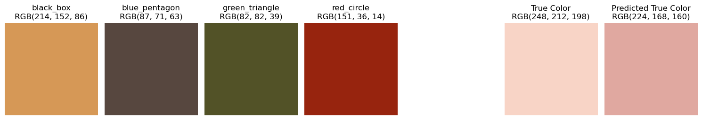

# Color Calibration Card Detection Project

## Project Overview and Objectives
This project aims to develop an automated system for detecting and standardizing color calibration cards in images. The system is designed to accurately locate color calibration cards and apply image processing techniques to achieve standardized presentation, laying the foundation for subsequent color calibration work.

The objective of this project is to use a calibration card to detect color, in any kind of circumstances. The detecting model can detect all kind of colors, which means it has the capability of generalization.

## Project Progress and Final Optimizing Goal

**Current Progress**: 
- V1 Finished: **Reaching the general commercial printing standard.** In Feb 20, the XGBoost model reach the highest score of Lab Mean ΔE = 5.20, Lab Median ΔE = 3.96. This result meets general commercial printing standards.

Through V1 exploration, it is showned that the tree model performs better in this group of dataset and trainings.

I will continue to explore the effects of other data sets, different data enhancements, and even different color recognition cards in the future.

**Future Development Plan:**
- V2 Stage: Reduce Mean ΔE to between 3-4, suitable for most commercial applications.
- V3 Stage: Reduce Lab Mean ΔE to below 2, reaching the professional color calibration field standard.

## Project Framework

The whole pipeline:


The card this project use:


## Project Environment and Structrue

### Environment

### Structure

```
Color_Calibration
│
├── notebooks/                     # Explanation and Demos. If you want to know
│                                  # roughly details, you can directly see here.
│
├── .dvc/                          # DVC configuration
├── data/                          # Data, all stored via DVC in GCP
│   ├── raw/                       # raw images
│   ├── processed/                 # processed images
│   ├── train/                     # training dataset
│   ├── test/                      # test dataset
│   ├── features/                  # store feature extraction .csv files
│   └── models/                    # store models
│
├── configs/                       # Configurations
│   ├── detect/                    # YOLOv8 configs
│   ├── feature/                
│   └── train/              
│
├── src/                           # Core application code
│   ├── data_processing/           # clean or process data for preparation
│   ├── detect/                    # YOLOv8 - detect calibration card patterns
│   ├── feature_extraction/        # extract features
│   ├── train/                     # train and evaluate model
│   └── /
│
├── test/                          # generalization test
│
├── docs/                          # docs, logs, readme files, etc.
├── outputs/                       # running files tracking, git ignored
└── README.md
```

<!-- 
```
color_calibration/
├── .github/                        # CI/CD workflows
│   └── workflows/
│       ├── ci.yml                 # Continuous Integration
│       ├── cd.yml                 # Continuous Deployment
│       └── model-training.yml     # Model training pipeline
│
│
├── deployment/                    # Deployment configurations
│   ├── docker/
│   │   ├── Dockerfile.api
│   │   ├── Dockerfile.training
│   │   └── docker-compose.yml
│   ├── kubernetes/
│   │   ├── api-deployment.yaml
│   │   ├── training-job.yaml
│   │   └── monitoring/
│   └── terraform/                # Infrastructure as Code
│       ├── main.tf
│       └── variables.tf
│
├── mlops/                        # MLOps specific code
│   ├── monitoring/
│   │   ├── metrics.py
│   │   └── alerts.py
│   ├── pipelines/
│   │   ├── training_pipeline.py
│   │   └── deployment_pipeline.py
│   └── serving/
│       ├── api.py
│       └── middleware.py
│
├── tools/                       # Development tools
│   ├── quality_checks/
│   └── model_analysis/
│
├── .env.example                 # Environment variables template
├── Makefile                     # Build automation
├── requirements/
│   ├── requirements.txt         # Base requirements
│   ├── requirements-dev.txt     # Development requirements
│   └── requirements-prod.txt    # Production requirements
│
└── scripts/
    ├── setup_monitoring.sh
    ├── deploy_model.sh
    └── run_tests.sh
```

├── notebooks/
│   ├── 01-data-exploration.ipynb      # 数据探索 & 可视化
│   ├── 02-data-cleaning.ipynb         # 数据清理
│   ├── 03-feature-engineering.ipynb   # 特征工程
│   ├── 04-model-training.ipynb        # 初步模型训练
│   ├── 05-hyperparameter-tuning.ipynb # 超参数优化
│   ├── 06-model-evaluation.ipynb      # 评估模型效果
│   ├── 07-inference.ipynb             # 预测 & 结果分析
│   ├── 08-visualization.ipynb         # 可视化最终结果
│   ├── experiments/                    # 额外实验
│   │   ├── experiment-baseline.ipynb   # 基线模型实验
│   │   ├── experiment-new-method.ipynb # 新方法测试
│   │   └── experiment-debug.ipynb      # 调试 Notebook
│   ├── reports/                         # 可选，存放最终报告
│   │   ├── final-report.ipynb
│   │   └── presentation.ipynb
│   ├── README.md                        # 目录说明
-->


## Phase 1: ETL Processing

### Find Patterns


**Step1. Annotation**

Implement YOLOv8 for color calibration card detection.

Firstly recognize the card:


Secondly recognize the patterns:


**Step2. Training YOLOv8 model**

Create a GCP VM to train the model:


**Step3. Use YOLOv8 to detect patterns**

Detect the card:


Detect the patterns:


Extract four patterns:


**Step4. Data Augmentation**

Using existant photos to make ddata augmentation.

Using albumentations to implement:
```
augmentations = [
    ("brightness", A.RandomBrightnessContrast(p=1.0)),
    ("hue", A.HueSaturationValue(p=1.0)),
    ("gamma", A.RandomGamma(p=1.0)),
    ("motion_blur", A.MotionBlur(blur_limit=5, p=1.0)),
    ("gaussian_blur", A.GaussianBlur(blur_limit=5, p=1.0)),
    ("clahe", A.CLAHE(clip_limit=4.0, p=1.0)),
    ("noise", A.ISONoise(p=1.0)),
    ("rotate", A.Rotate(limit=10, p=1.0, border_mode=cv2.BORDER_REFLECT)),
]
```

After augmentation, the augmentation method is marked in the file name:


The original 250 photos are increased to 2000+ photos.

**Step5. Extract Patterns**

Extract patterns and finish preparation for feature extractions.


After processing completed: Total number of images 2295, number of generated files 9263, number of failed images 21.

So far, the ETL process is finished. The next step is ETV.

## Phase 2: ETV Processing

1. **Feature Extraction**
   - Extract Red, Green, Blue, and Contrast values (`Rp, Gp, Bp, Cp`).
   - Label each detected pattern with its corresponding reference color.
   - Store extracted features in structured datasets for further processing.

After running extract_feature.py, the features of 9000 photos are stored in a .csv file:


The feature extraction logic now is calculate the center region of the photos, and calculate the mean RGB value. The features will be stored so there will be more feature extraction logics.

2. **Data Storage and Versioning**
   - Store processed data in a version-controlled database using **DVC**.
   - Maintain different versions for traceability and reproducibility.

Use DVC and GCP bucket to store and manage data files.

The data files including images and .csv are now stored in GCP bucket, the address is:
- gs://color_calibration


3. **Real RGB Values**

After above processings, the Rp, Gp, Bp, Cp (p for real photo) have extracted.

Now, the real values of Rs, Gs, Bs, Cs (s for standard) need to be known.

Rs, Gs, Bs are never change, so we only need to get Cs.

The real value is labeled as "real_rgb" in the last column:


## Phase 3: MTL - Model Training and Validation

In phase 3, the system will focus on **Machine Learning Training**:

### Model Selection

After **feature extraction**, the `dataset` contains approximately **2000 data points**. Given the feature mapping:


In this relationship:
- Rp, Gp, Bp: The camera-measured RGB values of known standard color of Red, Green, and Blue. Here p is for photo.
- Cp: The camera-measured RGB value of target patch, which is got in the calbration card.
- Rs, Gs, Bs: The standard and stable RGB value of Red(255,0,0), Green(0,255,0), and Blue(0,0,255)


Below is an overview of the universal color-correction logic, regardless of which specific model (linear, random forest, neural network, etc.) ultimately choose. The key idea is that if we can find the function, or the relationship between those two groups, for example, if we can find a transformation rule, for example, if that is a matrix, then we can get:


Or other kind of functions:


Then we can in turn to get:


Where Creal represent the real (or canonical) RGB of the target patch.

So this is the real goal of this project: find an efficient model to get the Creal. After considring, I decide to initially select and experiment with the following **five methods** for calibration and modeling:

1. **Linear Regression**  
2. **Random Forest**  
3. **Gradient Boosting Trees**  
4. **Small Neural Network**

Subsequent experiments will compare these methods, analyze their performance on the dataset, and select the optimal approach for further optimization. Most of above are Machine Learning models, but I still choose one classicial method to compare with others. The purpose of this project is not to find something to do with ML, but to find a suitable model to solve a real problem.

---

### Random Forest

I first selected **Random Forest** for color calibration prediction and evaluated the model's performance. This method will serve as the baseline for subsequent methods.

The complete methods and training process can now be found in `notebooks/M1_RandomForest.ipynb`.

#### Data Processing

- Read data from `feature_0216.csv` and rename relevant columns:
  - `Rp, Gp, Bp, Cp` represent the captured colors (affected by lighting conditions).
  - `Rs, Gs, Bs, Cs` represent the standard reference colors (true colors).
- Parse the `(R, G, B)` color strings and split them into individual `R, G, B` values.
- Compute the **color deviation** between the captured values of reference objects (red, green, blue) and their standard values (`Delta_RR_red, Delta_RG_red, Delta_RB_red`, etc.).
- Construct the feature matrix `X`, including:
  - Color deviations (`Delta_RR_*`, `Delta_RG_*`, `Delta_RB_*`).
  - Captured color of the target object (`Cp_R, Cp_G, Cp_B`).
- The target variable `y` is set as `Cs_R, Cs_G, Cs_B` (true color RGB values).

#### Model Training and Evaluation

- **Model**: Trained using `RandomForestRegressor(n_estimators=500, random_state=42)`.
- **Data Split**: 70% training set, 30% test set (`train_test_split(X, y, test_size=0.3, random_state=42)`).
- **Evaluation Metrics**:
  - `R² Score`: `0.8225`
  - `RMSE`: `12.10`
  - `MAPE`: `4.33%`
  - **ΔE (Lab Color Space Error)**:
    - **Mean ΔE**: `5.20`
    - **Median ΔE**: `3.96`
  - **Error Distribution**:
    - A histogram is used to show the distribution of ΔE errors and evaluate the overall accuracy of the model’s predictions.

Model prediction visualization:


#### Baseline Comparison

To evaluate the effectiveness of the `Random Forest` model, we introduced a **non-model baseline**:
- **Baseline Method**: Predict `y_test` using the mean of `y_train`.
- **Baseline Evaluation**:
  - `Baseline R² Score`: `-0.0037`
  - `Baseline RMSE`: `31.55`
  - `Baseline MAPE`: `14.98%`
  - `Baseline Mean ΔE (Lab)`: `14.61`
  - `Baseline Median ΔE (Lab)`: `13.84`

The comparison shows that `Random Forest` **outperforms the baseline model in all metrics**, especially in reducing the `ΔE (Lab)` error, demonstrating that the model effectively reduces color prediction deviations.

#### Color Prediction System

Based on the `Random Forest` model, we developed an automated **Color Prediction System**:
1. **Detect color regions in the image**:
   - Use the `YOLO` object detection model (`PatternDetector`) to recognize reference objects (`red_circle, green_triangle, blue_pentagon, black_box`).
   - Extract RGB color values from each detected region.
2. **Compute color deviations**:
   - Calculate `Delta_RR_*`, `Delta_RG_*`, `Delta_RB_*` as input features.
3. **Predict the true color of the target object**:
   - Use the trained `Random Forest` model for color correction.
4. **Visualization of results**:
   - Display the captured color (`Cp`), predicted true color (`Cs_pred`), and reference colors (`Rp, Gp, Bp`).

#### Real-World Testing and Error Analysis

Outside the training and test sets, I took an independent photo for testing. The color card in this image was not included in any of the collected data, making it a test of the model’s generalization ability.

***Note: This photo was specifically chosen to be taken under extremely yellow lighting conditions to simulate an extreme color shift.***

The photo is shown below:


The extraction process is as follows:


Final test results:



- In the real-world test image, the model-predicted color (`Cs_pred`) **is closer to the target color compared to the directly captured color (`Cp`)**.
- Computation of `ΔE` in the Lab color space:
  - `Cp vs True Color`: **`ΔE = 38.07`** ❌ (Significant error)
  - `Cs_pred vs True Color`: **`ΔE = 16.46`** ✅ (Significant improvement)

The results show that the `Random Forest` model significantly reduces color errors, making the predicted color much closer to the standard color.

However, the generalization ΔE is significantly higher than the ΔE observed in the training and test sets, indicating that the model's generalization ability still has room for improvement.

These test results serve as the `Baseline` for `Random Forest` color calibration. Future directions for improvement include:
- Expanding the dataset to improve model generalization.
- Exploring more complex models such as `XGBoost` or `Neural Networks` for comparison.
- Training in the `Lab` color space to enhance perceptual consistency.

---


### Linear Regression 3x3

**Model Configuration:**  
- **Algorithm:** Linear Regression  
- **Input Features:** Standardized RGB values and reference color differences  
- **Training Strategy:** Least squares optimization (linear transformation matrix)  
- **Reasoning:**  
  - Linear regression is a simple and interpretable approach that attempts to find the optimal transformation matrix mapping input colors to corrected colors.  
  - Since color correction is inherently a non-linear problem, linear regression may struggle to capture subtle variations.  

**Results:**  
- **R² Score:** 0.7113  
- **RMSE:** 14.98  
- **MAPE:** 6.41%  
- **Mean Color Difference (ΔE):** 20.87  
- **Mean ΔE (Lab):** 6.63  
- **Median ΔE (Lab):** 5.53  


**Observations:**  
Linear regression provides a basic baseline but fails to capture non-linearities in color transformations. It produces the highest color difference errors, suggesting that a more flexible model is needed.

---

### Gradient Boosting Trees (XGBoost)

**Model Configuration:**  
- **Algorithm:** XGBoost (Gradient Boosting Decision Trees)  
- **Boosting Rounds:** 500  
- **Learning Rate:** 0.1  
- **Tree Depth:** 5  
- **Objective:** Squared error loss (reg:squarederror)  
- **Reasoning:**  
  - Gradient Boosting Trees (GBT) iteratively improve predictions by focusing on previous errors.  
  - GBT models are well-suited for structured data and can effectively model non-linear relationships.  
  - XGBoost provides built-in support for multi-output regression, making it a strong candidate for color prediction tasks.  

**Results:**  
- **R² Score:** 0.8280  
- **RMSE:** 11.76  
- **MAPE:** 4.09%  
- **Mean Color Difference (ΔE):** 13.64  
- **Mean ΔE (Lab):** 5.14  
- **Median ΔE (Lab):** 3.95  


**Observations:**  
XGBoost performs the best among the tested models. The boosting mechanism helps capture complex interactions between input features, reducing prediction errors significantly.

---

### Small Neural Network (MLP)

**Model Configuration:**  
- **Network Architecture:**  
  - Input Layer: Features from color calibration  
  - Hidden Layer 1: 64 neurons (ReLU activation)  
  - Hidden Layer 2: 64 neurons (ReLU activation)  
  - Output Layer: 3 neurons (RGB values)  
- **Loss Function:** Mean Squared Error (MSE)  
- **Optimizer:** Adam (learning rate = 0.001)  
- **Training Epochs:** 500  
- **Batch Size:** 32  
- **Reasoning:**  
  - Neural networks can approximate non-linear relationships in color transformations.  
  - The chosen architecture is relatively small to avoid overfitting while still capturing relevant feature interactions.  
  - ReLU activation ensures efficient gradient propagation, while Adam optimizer adapts learning rates for better convergence.  

**Results:**  
- **R² Score:** 0.7068  
- **RMSE:** 14.22  
- **MAPE:** 5.92%  
- **Mean Color Difference (ΔE):** 20.21  
- **Mean ΔE (Lab):** 7.39  
- **Median ΔE (Lab):** 6.70  


**Observations:**  
The neural network underperforms compared to XGBoost, likely due to limited data or suboptimal hyperparameters. More complex architectures, additional training epochs, or data augmentation might improve results.


### Validation

Evaluate different models for best accuracy.

Apply hyperparameter tuning to optimize model performance.

## Phase 4: Model Processing & Deployment

1. **MLflow Experiment Tracking & Model Registry**
   - Track all model training runs, hyperparameters, and performance metrics using **MLflow**.
   - Register the best-performing models in the **MLflow Model Registry** with version control.
   - Enable easy rollback in case of performance degradation.
   - Maintain metadata logs for auditability and traceability.

2. **Model Packaging & Deployment**
   - Convert trained models into **deployable inference artifacts**.
   - Optimize models for real-time inference (e.g., quantization, ONNX, TensorRT).
   - Deploy the trained model as a **FastAPI REST API** for real-time inference.
   - Containerize the deployment using **Docker & Kubernetes**.
   - Implement **auto-scaling** to handle different workloads.

3. **Monitoring & Continuous Improvement**
   - Implement monitoring tools (**Prometheus, Grafana**) to track model performance.
   - Detect **concept drift** and trigger model retraining when necessary.
   - Set up an **alerting system** for anomaly detection and failures.
