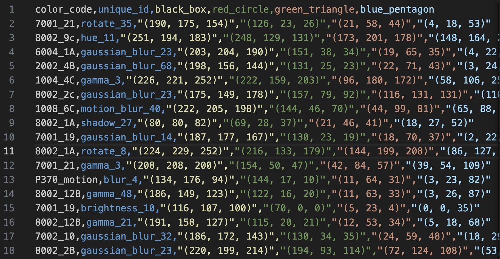

# Color Calibration Card Detection Project

## Project Overview and Objectives
This project aims to develop an automated system for detecting and standardizing color calibration cards in images. The system is designed to accurately locate color calibration cards and apply image processing techniques to achieve standardized presentation, laying the foundation for subsequent color calibration work.

The objective of this project is to use a calibration card to detect color, in any kind of circumstances. The detecting model can detect all kind of colors, which means it has the capability of generalization.


## Project Framework

The whole pipeline:


The card this project use:


## Project Environment and Structrue

### Environment

### Structure

```
Color_Calibration
│
├── notebooks/                     # Explanation and Demos. If you want to know
│                                  # roughly details, you can directly see here.
│
├── .dvc/                          # DVC configuration
├── data/                          # Data, all stored via DVC in GCP
│   ├── raw/                       # raw images
│   ├── processed/                 # processed images
│   ├── train/                     # training dataset
│   ├── test/                      # test dataset
│   ├── features/                  # store feature extraction .csv files
│   └── models/                    # store models
│
├── configs/                       # Configurations
│   ├── detect/                    # YOLOv8 configs
│   ├── feature/                
│   └── train/              
│
├── src/                           # Core application code
│   ├── data_processing/           # clean or process data for preparation
│   ├── detect/                    # YOLOv8 - detect calibration card patterns
│   ├── feature_extraction/        # extract features
│   ├── train/                     # train model
│   └── /
│
├── docs/                          # docs, logs, readme files, etc.
├── outputs/                       # running files tracking, git ignored
└── README.md
```

<!-- 
```
color_calibration/
├── .github/                        # CI/CD workflows
│   └── workflows/
│       ├── ci.yml                 # Continuous Integration
│       ├── cd.yml                 # Continuous Deployment
│       └── model-training.yml     # Model training pipeline
│


│
├── deployment/                    # Deployment configurations
│   ├── docker/
│   │   ├── Dockerfile.api
│   │   ├── Dockerfile.training
│   │   └── docker-compose.yml
│   ├── kubernetes/
│   │   ├── api-deployment.yaml
│   │   ├── training-job.yaml
│   │   └── monitoring/
│   └── terraform/                # Infrastructure as Code
│       ├── main.tf
│       └── variables.tf
│
├── mlops/                        # MLOps specific code
│   ├── monitoring/
│   │   ├── metrics.py
│   │   └── alerts.py
│   ├── pipelines/
│   │   ├── training_pipeline.py
│   │   └── deployment_pipeline.py
│   └── serving/
│       ├── api.py
│       └── middleware.py
│
│
│
├── tests/                       # Test suite
│   ├── unit/
│   ├── integration/
│   └── e2e/
│
├── tools/                       # Development tools
│   ├── quality_checks/
│   └── model_analysis/
│
├── .env.example                 # Environment variables template
├── Makefile                     # Build automation
├── requirements/
│   ├── requirements.txt         # Base requirements
│   ├── requirements-dev.txt     # Development requirements
│   └── requirements-prod.txt    # Production requirements
│
└── scripts/
    ├── setup_monitoring.sh
    ├── deploy_model.sh
    └── run_tests.sh
```

├── notebooks/
│   ├── 01-data-exploration.ipynb      # 数据探索 & 可视化
│   ├── 02-data-cleaning.ipynb         # 数据清理
│   ├── 03-feature-engineering.ipynb   # 特征工程
│   ├── 04-model-training.ipynb        # 初步模型训练
│   ├── 05-hyperparameter-tuning.ipynb # 超参数优化
│   ├── 06-model-evaluation.ipynb      # 评估模型效果
│   ├── 07-inference.ipynb             # 预测 & 结果分析
│   ├── 08-visualization.ipynb         # 可视化最终结果
│   ├── experiments/                    # 额外实验
│   │   ├── experiment-baseline.ipynb   # 基线模型实验
│   │   ├── experiment-new-method.ipynb # 新方法测试
│   │   └── experiment-debug.ipynb      # 调试 Notebook
│   ├── reports/                         # 可选，存放最终报告
│   │   ├── final-report.ipynb
│   │   └── presentation.ipynb
│   ├── README.md                        # 目录说明
-->


## Phase 1: ETL Processing

### Find Patterns


**Step1. Annotation**

Implement YOLOv8 for color calibration card detection.

Firstly recognize the card:


Secondly recognize the patterns:


**Step2. Training YOLOv8 model**

Create a GCP VM to train the model:


**Step3. Use YOLOv8 to detect patterns**

Detect the card:


Detect the patterns:


Extract four patterns:


**Step4. Data Augmentation**

Using existant photos to make ddata augmentation.

Using albumentations to implement:
```
augmentations = [
    ("brightness", A.RandomBrightnessContrast(p=1.0)),
    ("hue", A.HueSaturationValue(p=1.0)),
    ("gamma", A.RandomGamma(p=1.0)),
    ("motion_blur", A.MotionBlur(blur_limit=5, p=1.0)),
    ("gaussian_blur", A.GaussianBlur(blur_limit=5, p=1.0)),
    ("clahe", A.CLAHE(clip_limit=4.0, p=1.0)),
    ("noise", A.ISONoise(p=1.0)),
    ("rotate", A.Rotate(limit=10, p=1.0, border_mode=cv2.BORDER_REFLECT)),
]
```

After augmentation, the augmentation method is marked in the file name:


The original 250 photos are increased to 2000+ photos.

**Step5. Extract Patterns**

Extract patterns and finish preparation for feature extractions.


After processing completed: Total number of images 2295, number of generated files 9263, number of failed images 21.

So far, the ETL process is finished. The next step is ETV.

## Phase 2: ETV Processing

1. **Feature Extraction**
   - Extract Red, Green, Blue, and Contrast values (`Rp, Gp, Bp, Cp`).
   - Label each detected pattern with its corresponding reference color.
   - Store extracted features in structured datasets for further processing.

After running extract_feature.py, the features of 9000 photos are stored in a .csv file:



The feature extraction logic now is calculate the center region of the photos, and calculate the mean RGB value. The features will be stored so there will be more feature extraction logics.

2. **Data Storage and Versioning**
   - Store processed data in a version-controlled database using **DVC**.
   - Maintain different versions for traceability and reproducibility.

Use DVC and GCP bucket to store and manage data files.

The data files including images and .csv are now stored in GCP bucket, the address is:
- gs://color_calibration


3. **Real RGB Values**

After above processings, the Rp, Gp, Bp, Cp (p for real photo) have extracted.

Now, the real values of Rs, Gs, Bs, Cs (s for standard) need to be known.

Rs, Gs, Bs are never change, so we only need to get Cs.

The real value is labeled as "real_rgb" in the last column:


## Phase 3: MTL - Model Training and Validation

In phase 3, the system will focus on **Machine Learning Training**:

### Model Selection

After **feature extraction**, the `dataset` contains approximately **2000 data points**. Given the feature mapping:


In this relationship:
- Rp, Gp, Bp: The camera-measured RGB values of known standard color of Red, Green, and Blue. Here p is for photo.
- Cp: The camera-measured RGB value of target patch, which is got in the calbration card.
- Rs, Gs, Bs: The standard and stable RGB value of Red(255,0,0), Green(0,255,0), and Blue(0,0,255)


Below is an overview of the universal color-correction logic, regardless of which specific model (linear, random forest, neural network, etc.) ultimately choose. The key idea is that if we can find the function, or the relationship between those two groups, for example, if we can find a transformation rule, for example, if that is a matrix, then we can get:


Or other kind of functions:


Then we can in turn to get:


Where Creal represent the real (or canonical) RGB of the target patch.

So this is the real goal of this project: find an efficient model to get the Creal. After considring, I decide to initially select and experiment with the following **five methods** for calibration and modeling:

1. **Linear 3×3 Matrix Correction** (Classical traditional method)  
2. **Linear Regression**  
3. **Random Forest**  
4. **Gradient Boosting Trees**  
5. **Small Neural Network**

Subsequent experiments will compare these methods, analyze their performance on the dataset, and select the optimal approach for further optimization. Most of above are Machine Learning models, but I still choose one classicial method to compare with others. The purpose of this project is not to find something to do with ML, but to find a suitable model to solve a real problem.


### Linear 3x3 (Traditional Method)

### Linear Regression

### Random Forest

### Gradient Boosting Trees

### Small Neural Network

### Validation

Evaluate different models for best accuracy.

Apply hyperparameter tuning to optimize model performance.

## Phase 4: Model Processing & Deployment

1. **MLflow Experiment Tracking & Model Registry**
   - Track all model training runs, hyperparameters, and performance metrics using **MLflow**.
   - Register the best-performing models in the **MLflow Model Registry** with version control.
   - Enable easy rollback in case of performance degradation.
   - Maintain metadata logs for auditability and traceability.

2. **Model Packaging & Deployment**
   - Convert trained models into **deployable inference artifacts**.
   - Optimize models for real-time inference (e.g., quantization, ONNX, TensorRT).
   - Deploy the trained model as a **FastAPI REST API** for real-time inference.
   - Containerize the deployment using **Docker & Kubernetes**.
   - Implement **auto-scaling** to handle different workloads.

3. **Monitoring & Continuous Improvement**
   - Implement monitoring tools (**Prometheus, Grafana**) to track model performance.
   - Detect **concept drift** and trigger model retraining when necessary.
   - Set up an **alerting system** for anomaly detection and failures.
